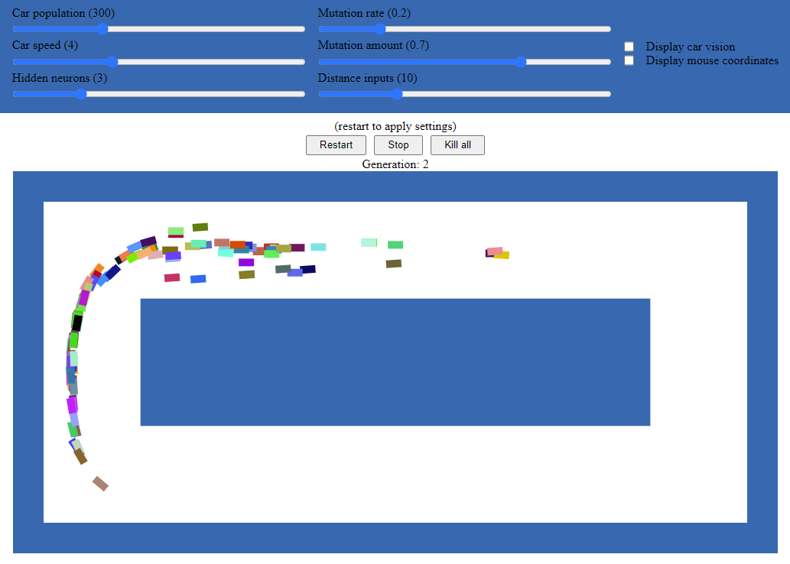

# Neural Network Cars
This repository showcases a simulation of cars in a race driving on a simple track, where each car is being steered by their own neural network. In the first generation of cars the neural networks are initialized randomly, but in the following generations will be mutations of the previously best performing car. The measurement of a car’s performance is simply by the duration of the car’s survival, or more accurately how many frames it can avoid hitting a wall. The simulation has some changeable parameters as seen on the screenshot bellow, and the whole simulation can be found on GitHub Pages [here](https://tobynatooor.github.io/nn-cars/).

## Screenshot

